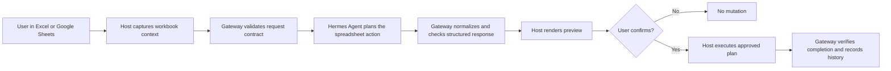
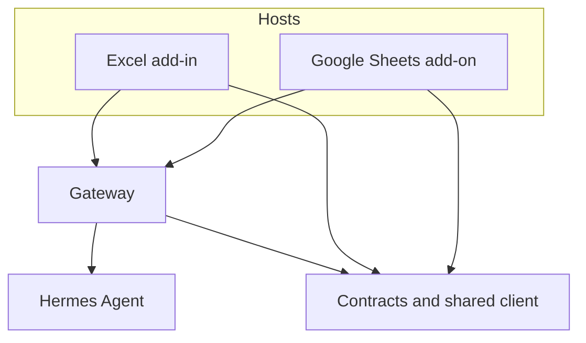

# Hermes Spreadsheet Suite

Hermes Spreadsheet Suite is a spreadsheet-native execution product that brings **Hermes** into real Excel and Google Sheets workflows without turning the host into a second agent.

It targets three real spreadsheet surfaces:

- Microsoft Excel on Windows via Office.js
- Microsoft Excel on macOS via Office.js
- Google Sheets via Apps Script

The core idea is simple:

- Hermes Agent does the planning.
- Hermes Agent returns structured responses instead of free-form spreadsheet guesses.
- The gateway checks, normalizes, and controls those responses.
- The hosts preview and execute only the approved spreadsheet mutations.

That separation is what makes the product feel serious instead of toy-like. The model does not write directly into a workbook. It has to operate through contracts, previews, approval, and completion checks.

## Why This Project Is Compelling

Hermes Spreadsheet Suite is interesting because it solves a real product problem, not just a demo prompt:

- spreadsheets need context-aware reasoning, but also exact execution
- users need previews and confirmation before writes
- hosts should not become ad hoc reasoning systems
- multi-step spreadsheet work needs structured plans, not raw chat text
- execution needs traceability, safety boundaries, and completion checks

This repo is the execution surface around Hermes for spreadsheet work. It exists to make spreadsheet automation feel trustworthy, inspectable, and actually usable in production-style workflows.

## What Hermes Does Here

Hermes Agent is the central product brain in this system. It is the planner and structured response generator.

Hermes is responsible for:

- understanding spreadsheet intent from real workbook context
- choosing the right capability family
- producing structured responses that match explicit contracts
- driving multi-step spreadsheet workflows
- generating confirmable write proposals instead of mutating sheets directly

The rest of the repo exists to make those Hermes decisions safe and executable:

- the hosts gather workbook state, render previews, and apply approved writes
- the gateway enforces contracts, approval, trace, completion checks, and execution control
- shared contracts keep every layer aligned on the same capability model

## Core Product Flow



In plain terms:

1. A user asks Hermes to do spreadsheet work.
2. The host captures real workbook context.
3. The gateway validates the request envelope.
4. Hermes Agent returns a structured response.
5. The host previews anything write-capable.
6. The user explicitly confirms.
7. The host applies the approved plan.
8. The gateway verifies what happened and records execution history.

## Structured Response Template

Hermes does not need to return vague prose. It can return a structured response that the gateway and hosts can validate before anything is executed.

A simplified example looks like this:

```json
{
  "operation": "sheet_update",
  "targetSheet": "Q2 Plan",
  "targetRange": "A1:D6",
  "data": {
    "operation": "replace_range",
    "values": [
      ["Owner", "Task", "Status", "ETA"],
      ["Ana", "Draft launch brief", "In progress", "2026-05-02"]
    ],
    "shape": { "rows": 2, "columns": 4 },
    "explanation": "Create a compact launch tracker with the requested columns.",
    "confidence": 0.93,
    "requiresConfirmation": true,
    "overwriteRisk": "low"
  },
  "trace": [
    {
      "step": "plan",
      "message": "Mapped the request to a confirmed sheet update plan."
    }
  ]
}
```

What matters is the contract, not the exact wording of the example:

- Hermes Agent plans the action
- the response is structured and machine-checkable
- the host can preview the write before execution
- the final mutation still requires explicit confirmation

## Capability Surface

The current first-class capability families live in [docs/capability-surface.md](docs/capability-surface.md).

## Architecture



The architecture is intentionally simple:

- **Hermes Agent** is the planner and structured response generator.
- **Gateway** is the safety and control plane: contract validation, normalization, approval, completion checks, trace, uploads, and execution control.
- **Hosts** are the execution surfaces: they collect workbook context, show previews, and apply approved mutations on supported plan families.
- **Contracts and shared client helpers** keep every layer aligned on the same capability model.

## Repo Layout

| Path | Purpose |
| --- | --- |
| `apps/excel-addin/` | Excel Office.js host |
| `apps/google-sheets-addon/` | Google Sheets Apps Script host |
| `services/gateway/` | Hermes gateway and writeback control plane |
| `packages/contracts/` | Cross-layer schemas and contract types |
| `packages/shared-client/` | Shared client helpers and gateway client |
| `extensions/skills/` | Example external skills outside Hermes core |
| `docs/` | Demo notes, review notes, plans, specs, and contributor guidance |

## Quick Start

### 1. Install

```bash
npm install
```

### 2. Configure the gateway

```bash
cp .env.example .env
```

At minimum, set:

```bash
PORT=8787
GATEWAY_PUBLIC_BASE_URL=http://127.0.0.1:8787
HERMES_SERVICE_LABEL=spreadsheet-gateway
HERMES_ENVIRONMENT_LABEL=local-dev
# Required: replace with a long random value; never commit a real secret.
APPROVAL_SECRET=<REPLACE_ME_LONG_RANDOM_SECRET>
HERMES_AGENT_BASE_URL=http://127.0.0.1:8642/v1
SKILL_REGISTRY_PATH=../../extensions/registry/skill-registry.json
```

### 3. Start the gateway

```bash
npm run dev:gateway
```

### 4. Check health

```bash
curl http://127.0.0.1:8787/health
```

### 5. Start example sidecars if your Hermes deployment uses them

```bash
npm run dev:selection-skill
```

```bash
npm run dev:table-skill
```

## Host Setup

### Excel

- setup guides:
  - [Excel Windows Setup](docs/setup/excel-windows.md)
  - [Excel macOS Setup](docs/setup/excel-macos.md)
- manifest files:
  - `apps/excel-addin/manifest.xml`
  - `apps/excel-addin/manifest.live.xml`
- release/deploy notes: [RELEASE.md](RELEASE.md)

### Google Sheets

- setup guide:
  - [Google Sheets Setup](docs/setup/google-sheets.md)
- Apps Script source lives under `apps/google-sheets-addon/`
- live-demo guidance lives in [docs/demo-runbook.md](docs/demo-runbook.md)

## Documentation Map

- contributor guide: [CONTRIBUTING.md](CONTRIBUTING.md)
- setup guides: [docs/setup/README.md](docs/setup/README.md)
- capability surface: [docs/capability-surface.md](docs/capability-surface.md)
- testing guide: [docs/testing.md](docs/testing.md)
- demo runbook: [docs/demo-runbook.md](docs/demo-runbook.md)
- reviewer checklist: [docs/reviewer-checklist.md](docs/reviewer-checklist.md)
- release/deploy notes: [RELEASE.md](RELEASE.md)
- capability backlog: [docs/missing-capabilities-backlog-2026-04-23.md](docs/missing-capabilities-backlog-2026-04-23.md)
- product backlog: [docs/product-backlog-2026-04-24.md](docs/product-backlog-2026-04-24.md)

## Contribution Standard

Before opening a PR, make sure the change:

- keeps Hermes as the central product brain
- preserves contract safety
- keeps writeback explicit and confirmable
- adds regression coverage for any new capability family or safety boundary touched
- documents behavior when the host is preview-only or unsupported

Use the PR template in `.github/pull_request_template.md`.
