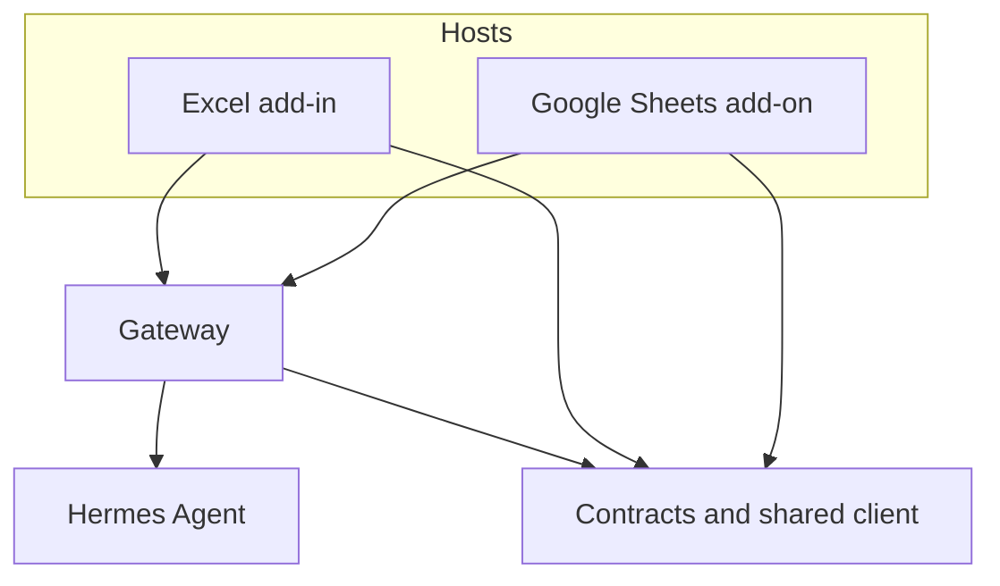

# Hermes Spreadsheet Suite

Hermes Spreadsheet Suite is the spreadsheet-native execution product for **Hermes** across:

- Microsoft Excel on Windows via Office.js
- Microsoft Excel on macOS via Office.js
- Google Sheets via Apps Script

Hermes is the central spreadsheet brain. This repo is the product boundary that lets Hermes operate inside real workbooks and sheets without turning hosts into a second reasoning system.

It exists to make Hermes usable, safe, and exact in spreadsheets:

- it collects real workbook context
- it routes spreadsheet intent through contract-checked flows
- it renders previews before execution
- it translates approved plans into exact host mutations
- it verifies completion against the approved plan

This is not a thin wrapper around a model. It is the execution surface around Hermes for spreadsheet work.

## What Hermes Does Here

Hermes is responsible for the product-level intelligence:

- understanding spreadsheet intent from real workbook context
- choosing the right capability family
- returning structured responses, not free-form guesses
- driving multi-step spreadsheet workflows
- producing confirmable write proposals instead of mutating sheets directly

The rest of the repo exists to make those Hermes decisions safe and executable:

- the hosts gather workbook state, render previews, and apply approved writes
- the gateway enforces contracts, approval, trace, completion checks, and execution control
- shared contracts keep all layers aligned on what a valid spreadsheet action actually is

## Core Product Flow


In plain terms:

1. A user asks Hermes to do spreadsheet work.
2. The host captures the real workbook state.
3. The gateway validates the request envelope.
4. Hermes returns a structured spreadsheet response.
5. The host previews anything write-capable.
6. The user explicitly confirms.
7. The host applies the plan.
8. The gateway verifies what happened and records execution history.

## Capability Surface

The current first-class capability families live in [docs/capability-surface.md](docs/capability-surface.md).

## Architecture



The architecture is intentionally simple:

- **Hermes Agent** is the planner and structured response generator.
- **Gateway** is the safety and control plane: contract validation, normalization, approval, completion checks, trace, uploads, and execution control.
- **Hosts** are the execution surfaces: they collect workbook context, show previews, and apply approved mutations on supported plan families.
- **Contracts and shared client helpers** keep every layer aligned on the same capability model.

## Repo Layout

| Path | Purpose |
| --- | --- |
| `apps/excel-addin/` | Excel Office.js host |
| `apps/google-sheets-addon/` | Google Sheets Apps Script host |
| `services/gateway/` | Hermes gateway and writeback control plane |
| `packages/contracts/` | Cross-layer schemas and contract types |
| `packages/shared-client/` | Shared client helpers and gateway client |
| `extensions/skills/` | Example external skills outside Hermes core |
| `docs/` | Demo notes, review notes, plans, specs, and contributor guidance |

## Quick Start

### 1. Install

```bash
npm install
```

### 2. Configure the gateway

```bash
cp .env.example .env
```

At minimum, set:

```bash
PORT=8787
GATEWAY_PUBLIC_BASE_URL=http://127.0.0.1:8787
HERMES_SERVICE_LABEL=spreadsheet-gateway
HERMES_ENVIRONMENT_LABEL=local-dev
APPROVAL_SECRET=replace-with-a-long-random-secret
HERMES_AGENT_BASE_URL=http://127.0.0.1:8642/v1
SKILL_REGISTRY_PATH=../../extensions/registry/skill-registry.json
```

### 3. Start the gateway

```bash
npm run dev:gateway
```

### 4. Check health

```bash
curl http://127.0.0.1:8787/health
```

### 5. Start example sidecars if your Hermes deployment uses them

```bash
npm run dev:selection-skill
```

```bash
npm run dev:table-skill
```

## Host Setup

### Excel

- setup guides:
  - [Excel Windows Setup](docs/setup/excel-windows.md)
  - [Excel macOS Setup](docs/setup/excel-macos.md)
- manifest files:
  - `apps/excel-addin/manifest.xml`
  - `apps/excel-addin/manifest.live.xml`
- release/deploy notes: [RELEASE.md](RELEASE.md)

### Google Sheets

- setup guide:
  - [Google Sheets Setup](docs/setup/google-sheets.md)
- Apps Script source lives under `apps/google-sheets-addon/`
- live-demo guidance lives in [docs/demo-runbook.md](docs/demo-runbook.md)

## Documentation Map

- contributor guide: [CONTRIBUTING.md](CONTRIBUTING.md)
- setup guides: [docs/setup/README.md](docs/setup/README.md)
- capability surface: [docs/capability-surface.md](docs/capability-surface.md)
- testing guide: [docs/testing.md](docs/testing.md)
- demo runbook: [docs/demo-runbook.md](docs/demo-runbook.md)
- reviewer checklist: [docs/reviewer-checklist.md](docs/reviewer-checklist.md)
- release/deploy notes: [RELEASE.md](RELEASE.md)
- capability backlog: [docs/missing-capabilities-backlog-2026-04-23.md](docs/missing-capabilities-backlog-2026-04-23.md)
- product backlog: [docs/product-backlog-2026-04-24.md](docs/product-backlog-2026-04-24.md)

## Contribution Standard

Before opening a PR, make sure the change:

- keeps Hermes as the central product brain
- preserves contract safety
- keeps writeback explicit and confirmable
- adds regression coverage for any new capability family or safety boundary touched
- documents behavior when the host is preview-only or unsupported

Use the PR template in `.github/pull_request_template.md`.
